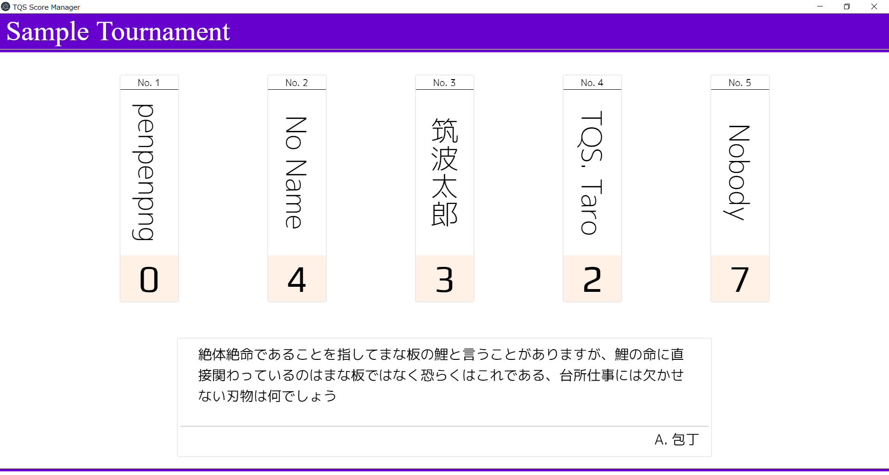

# qtsukuba-score-manager
2018年度雙峰祭とQ-Tsukubaのための得点表示システムです。





## Build
ビルドには[npm](https://www.npmjs.com/)が必要です。

Windowsユーザはルートディレクトリで以下を実行してください。
Macユーザは`npm run build`の代わりに`npm run build:mac`を実行してください。

``` bash
npm install
npm run build
```

もしあなたが開発者ならば、以下のスクリプトでhot reloadingを有効にした状態で試運転できます。

``` bash
npm run dev
```


---

This project was generated with [electron-vue](https://github.com/SimulatedGREG/electron-vue)@[dab4535](https://github.com/SimulatedGREG/electron-vue/tree/dab4535ddea5bb2f8cb754c117d75cc1af2d1f5b) using [vue-cli](https://github.com/vuejs/vue-cli). Documentation about the original structure can be found [here](https://simulatedgreg.gitbooks.io/electron-vue/content/index.html).
